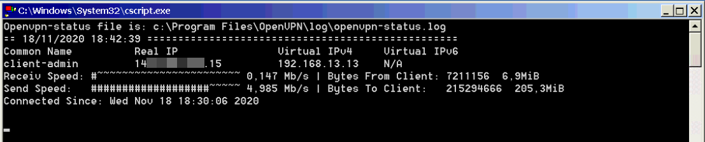

## Table of contents
* [General info](#general-info)
* [Technologies](#technologies)
* [Setup](#setup)
* [Start](#start)

## General info
This script was designed to parse the status file of the OpenVPN server installed on MS Windows operating system.
Supports 3 versions of the file status format.  
There are many good scripts on Github that parse the OpenVPN status file for Unix/Linux OS. There are projects on PHP and projects in Dockers. There is an OpenVPN exporter for Prometheus. it's great!  
But I had several small remote servers on MS Windows. And my task was to track connected clients without installing any components.  
I will share my old school script with you.
	
## Technologies
The script is written for:
* Windows Script Host (WSH)
* VBScript
	
## Setup
Configuring the OpenVPN server for maintaining the file status.
Add to your server config file *server.ovpn*:
```
status file
status-version [n]
```
Where **file** is the path to openvpn-status.log  
And status-version [n]  
Set the status file format version number to **n**. This only affects the status file on servers with multi-client capability enabled.  
1 - traditional format (default). The client list contains the following fields comma-separated: Common Name, Real Address, Bytes Received, Bytes Sent, Connected Since.  
2 - a more reliable format for external processing. Compared to version 1, the client list contains some additional fields: Virtual Address, Virtual IPv6 Address, Username, Client ID, Peer ID. Future versions may extend the number of fields.  
3 - identical to 2, but fields are tab-separated.  
For example:
```
status "C:\\Program Files\\OpenVPN\\log\\openvpn-status.log"
status-version 1
```

## Start
The script is run in command line mode
```
C:\>cscript.exe ovpnstatus.vbs [status-file] [status-version]
```
Сan also be run without explicitly specifying *CScript.exe*
```
C:\>ovpnstatus.vbs [status-file] [status-version]
```
The script can receive two parameters: this is the path to the status file and the version of the status file
```
C:\>ovpnstatus.vbs "C:\Program Files\OpenVPN\log\openvpn-status.log" 1
```
The default parameters are used:
status-file is: "C:\Program Files\OpenVPN\log\openvpn-status.log"
status-version is: 1


